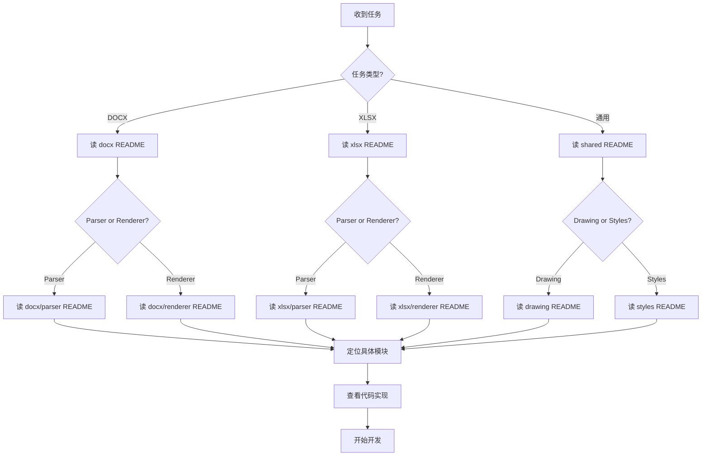

# 项目文档索引 Skill

## 📝 简介

本 skill 帮助 AI 快速了解 officeParserRenderer 项目的整体结构、各个模块的功能和职责。通过阅读各个 README 文档，AI 能够：

1. 快速定位需要修改的模块
2. 理解模块之间的依赖关系
3. 找到相关的工具和帮助函数
4. 避免重复实现已有功能
5. 保持代码风格和架构一致性

## 📚 文档结构

项目采用分层的文档结构，从顶层到底层依次为：

```
README.md (项目总览)
├── packages/docx/README.md (DOCX 包概览)
│   ├── packages/docx/src/parser/README.md
│   └── packages/docx/src/renderer/README.md
├── packages/xlsx/README.md (XLSX 包概览)
│   ├── packages/xlsx/src/parser/README.md
│   └── packages/xlsx/src/renderer/README.md
└── packages/shared/README.md (共享包概览)
    ├── packages/shared/src/drawing/README.md
    └── packages/shared/src/styles/README.md
```

## 🎯 使用策略

### 1. 初次接触项目时

阅读顺序：
1. `/Users/miyuefe/MyGitHub/ai-space/officeParserRenderer/README.md` - 了解项目整体
2. 根据任务类型选择对应的包 README：
   - DOCX 相关：`packages/docx/README.md`
   - XLSX 相关：`packages/xlsx/README.md`
   - 共享功能：`packages/shared/README.md`

### 2. 需要修改某个功能时

**步骤：**
1. 确定功能所属的包（docx/xlsx/shared）
2. 确定是解析 (parser) 还是渲染 (renderer) 相关
3. 阅读对应模块的 README
4. 查看具体文件的代码

**示例场景：**

#### 场景 1：修改 DOCX 表格渲染
```
任务：修复 DOCX 表格边框显示问题
↓
阅读：packages/docx/src/renderer/README.md
↓
定位：TableRenderer - 表格渲染器
↓
查看：packages/docx/src/renderer/TableRenderer.ts
```

#### 场景 2：添加新的 XLSX 图表类型
```
任务：添加 XLSX 雷达图支持
↓
阅读：packages/shared/src/drawing/README.md
↓
定位：ChartRenderer - 图表渲染器
↓
修改：packages/shared/src/drawing/renderers/ChartRenderer.ts
```

#### 场景 3：实现单位转换
```
任务：将 EMU 转换为像素
↓
阅读：packages/shared/src/styles/README.md
↓
定位：UnitConverter - 单位转换器
↓
使用：UnitConverter.emuToPx(emu)
```

### 3. 需要理解某个概念时

**常见概念及对应文档：**

| 概念 | 文档位置 | 说明 |
|------|----------|------|
| DrawingML | `packages/shared/src/drawing/README.md` | Office 图形标准 |
| EMU 单位 | `packages/shared/src/styles/README.md` | 单位转换 |
| 形状路径 | `packages/shared/src/drawing/README.md` | 形状库和 SVG 生成 |
| 单元格坐标 | `packages/xlsx/src/parser/README.md` | XLSX 坐标系统 |
| 样式索引 | `packages/xlsx/src/parser/README.md` | XLSX 样式引用机制 |
| 分页计算 | `packages/docx/src/renderer/README.md` | DOCX 分页逻辑 |
| 列表编号 | `packages/docx/src/parser/README.md` | 列表和编号系统 |

### 4. 需要添加新功能时

**步骤：**
1. 检查 shared 包是否已有相关工具
2. 检查其他包是否有类似实现
3. 确定新功能应该放在哪个模块
4. 遵循现有的架构模式

**架构原则：**
- **共享优先**：通用功能放在 shared 包
- **单一职责**：每个解析器/渲染器只处理一种类型
- **上下文传递**：使用 Context 对象共享状态
- **类型安全**：充分利用 TypeScript 类型系统

## 🔍 快速查找指南

### 按功能类型查找

#### 解析相关
- **DOCX 解析**：`packages/docx/src/parser/README.md`
  - 文档结构：DocumentParser
  - 段落：ParagraphParser
  - 文本：RunParser
  - 表格：TableParser
  - 绘图：DrawingParser
  - 样式：StylesParser
  
- **XLSX 解析**：`packages/xlsx/src/parser/README.md`
  - 工作簿：WorkbookParser
  - 工作表：WorksheetParser
  - 样式：StyleParser
  - 主题：ThemeParser
  - 绘图：DrawingParser

#### 渲染相关
- **DOCX 渲染**：`packages/docx/src/renderer/README.md`
  - 主渲染器：DocxRenderer
  - 段落：ParagraphRenderer
  - 文本：RunRenderer
  - 表格：TableRenderer
  - 绘图：DrawingRenderer
  - 页面布局：PageLayoutManager
  
- **XLSX 渲染**：`packages/xlsx/src/renderer/README.md`
  - 主渲染器：XlsxRenderer
  - 样式解析：StyleResolver
  - 单元格样式：CellStyleUtils
  - 布局计算：LayoutCalculator

#### 共享功能
- **绘图**：`packages/shared/src/drawing/README.md`
  - DrawingML 解析
  - 形状渲染
  - 图表渲染
  - 预设形状库
  
- **样式**：`packages/shared/src/styles/README.md`
  - 单位转换：UnitConverter
  - 文本样式：TextStyles
  - 对齐样式：AlignmentStyles
  - 边框样式：BorderStyles

### 按问题类型查找

#### 显示/样式问题
1. 确定元素类型（文本、表格、形状等）
2. 查看对应的 Renderer README
3. 检查样式应用逻辑
4. 参考 `packages/shared/src/styles/README.md`

#### 布局/定位问题
- **DOCX**：查看 `PageLayoutManager`, `PageCalculator`
- **XLSX**：查看 `LayoutCalculator`, `SheetLayoutManager`
- **绘图**：查看 `packages/shared/src/drawing/README.md` 的定位章节

#### 数据解析问题
1. 查看对应的 Parser README
2. 检查 XML 元素的解析逻辑
3. 验证类型定义是否正确

#### 性能问题
- **DOCX**：查看分页策略、DocumentFragment 使用
- **XLSX**：查看虚拟滚动实现
- **通用**：检查是否有重复计算、是否缓存结果

## 💡 最佳实践

### 修改代码前

1. **阅读相关 README**：理解模块的职责和设计
2. **查看类型定义**：理解数据结构
3. **查看现有实现**：学习代码风格和模式
4. **检查依赖**：确认需要的工具是否已存在

### 添加新功能时

1. **检查 shared 包**：避免重复实现
2. **遵循现有模式**：保持代码一致性
3. **更新类型定义**：保持类型安全
4. **添加注释**：使用中文注释，遵循 JSDoc 格式

### 调试问题时

1. **定位模块**：使用 README 快速定位问题所在模块
2. **理解流程**：查看 README 中的流程图和说明
3. **检查上下文**：确认 Context 对象是否正确传递
4. **验证单位**：检查单位转换是否正确

## 📋 文档使用检查清单

在开始工作前，确认以下事项：

- [ ] 已阅读项目总 README，了解项目整体架构
- [ ] 已阅读相关包的 README，了解包的功能范围
- [ ] 已阅读相关模块的 README，了解模块的职责
- [ ] 已检查 shared 包，确认没有重复实现
- [ ] 已理解相关的单位转换和坐标系统
- [ ] 已了解相关的类型定义
- [ ] 已理解模块之间的依赖关系

## 🔗 快速链接

### 主要 README 文档

```typescript
const README_PATHS = {
  // 顶层
  project: '/Users/miyuefe/MyGitHub/ai-space/officeParserRenderer/README.md',
  
  // 包级别
  docx: '/Users/miyuefe/MyGitHub/ai-space/officeParserRenderer/packages/docx/README.md',
  xlsx: '/Users/miyuefe/MyGitHub/ai-space/officeParserRenderer/packages/xlsx/README.md',
  shared: '/Users/miyuefe/MyGitHub/ai-space/officeParserRenderer/packages/shared/README.md',
  
  // DOCX 模块
  docxParser: '/Users/miyuefe/MyGitHub/ai-space/officeParserRenderer/packages/docx/src/parser/README.md',
  docxRenderer: '/Users/miyuefe/MyGitHub/ai-space/officeParserRenderer/packages/docx/src/renderer/README.md',
  
  // XLSX 模块
  xlsxParser: '/Users/miyuefe/MyGitHub/ai-space/officeParserRenderer/packages/xlsx/src/parser/README.md',
  xlsxRenderer: '/Users/miyuefe/MyGitHub/ai-space/officeParserRenderer/packages/xlsx/src/renderer/README.md',
  
  // Shared 模块
  drawing: '/Users/miyuefe/MyGitHub/ai-space/officeParserRenderer/packages/shared/src/drawing/README.md',
  styles: '/Users/miyuefe/MyGitHub/ai-space/officeParserRenderer/packages/shared/src/styles/README.md',
};
```

## 🎓 学习路径

### 入门级（刚接触项目）
1. 阅读项目总 README
2. 阅读一个包的 README（根据任务选择）
3. 浏览一个模块的 README

### 中级（开始开发功能）
1. 深入阅读相关模块的 README
2. 理解模块间的依赖关系
3. 掌握 shared 包的常用工具

### 高级（架构级理解）
1. 阅读所有 README 文档
2. 理解整体架构设计
3. 能够做出架构级的决策

## ⚠️ 注意事项

1. **README 是源头**：遇到问题时，先查阅 README
2. **保持更新**：如果发现 README 与代码不符，及时更新文档
3. **遵循约定**：README 中描述的架构模式应该被遵守
4. **善用搜索**：可以在 README 中搜索关键词快速定位

## 🚀 使用流程



---

**记住**：README 文档是你最好的指南。在修改代码前，花几分钟阅读相关文档，可以节省大量的时间和避免不必要的错误。
