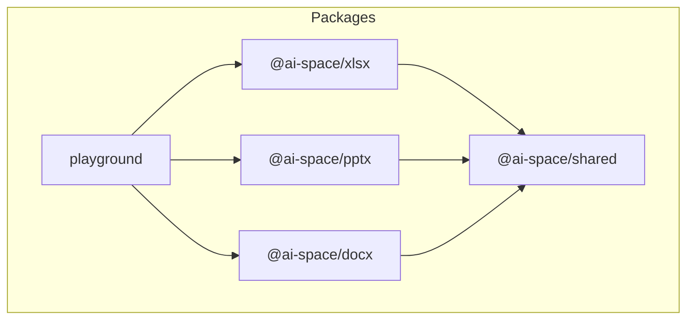
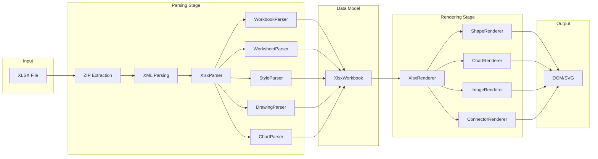
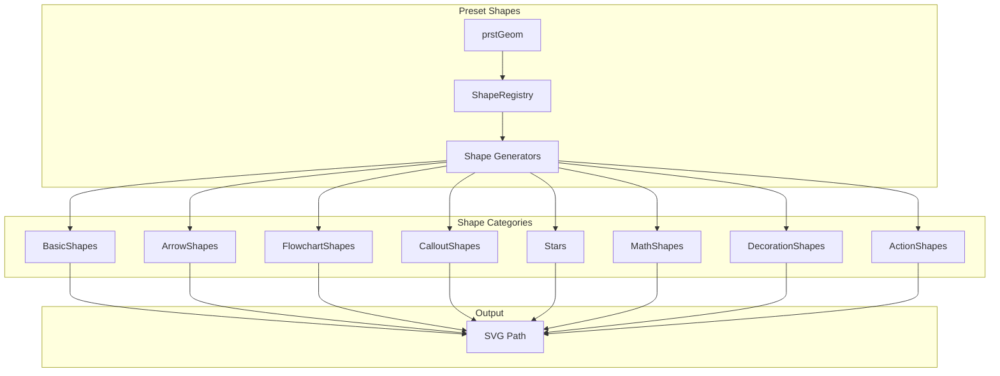

# Project Structure

This document describes the project structure and architecture design of the Office Document Parser and Renderer.

## Project Overview

This project is a library for parsing and rendering Microsoft Office documents (XLSX, PPTX, DOCX). It parses Office Open XML (OOXML) format documents into structured data and renders them as DOM and SVG elements in the browser, aiming to achieve pixel-perfect display consistency with Office software.

## Directory Structure

```
officeParserRenderer/
├── packages/                   # Main source code packages
│   ├── shared/                 # Shared utility library (@ai-space/shared)
│   │   └── src/
│   │       ├── index.ts        # Module entry
│   │       ├── xml/            # XML parsing utilities
│   │       ├── zip/            # ZIP extraction service
│   │       ├── utils/          # Common utilities
│   │       │   ├── ColorUtils.ts      # Color processing
│   │       │   ├── Units.ts           # Unit conversion
│   │       │   ├── geometry.ts        # Geometry calculations
│   │       │   └── PresetColorMap.ts  # Preset color mapping
│   │       └── drawing/        # DrawingML processing
│   │           ├── types.ts           # Type definitions
│   │           ├── DrawingMLParser.ts # Parser facade
│   │           ├── ThemeEnums.ts      # Theme enumerations
│   │           ├── parsers/           # Various parsers
│   │           └── shapes/            # Shape generators
│   │
│   ├── xlsx/                   # XLSX processing library (@ai-space/xlsx)
│   │   └── src/
│   │       ├── index.ts        # Module entry
│   │       ├── types.ts        # Type definitions
│   │       ├── parser/         # Parsers
│   │       │   ├── XlsxParser.ts      # Main parser
│   │       │   ├── WorkbookParser.ts  # Workbook parser
│   │       │   ├── WorksheetParser.ts # Worksheet parser
│   │       │   ├── StyleParser.ts     # Style parser
│   │       │   ├── ThemeParser.ts     # Theme parser
│   │       │   ├── DrawingParser.ts   # Drawing parser
│   │       │   └── ChartParser.ts     # Chart parser
│   │       ├── renderer/       # Renderers
│   │       │   ├── XlsxRenderer.ts    # Main renderer
│   │       │   ├── ShapeRenderer.ts   # Shape renderer
│   │       │   ├── ChartRenderer.ts   # Chart renderer
│   │       │   ├── ImageRenderer.ts   # Image renderer
│   │       │   ├── ConnectorRenderer.ts # Connector renderer
│   │       │   └── StyleResolver.ts   # Style resolution helper
│   │       └── utils/          # Utilities
│   │           ├── Enums.ts           # Enum definitions
│   │           └── NumberFormatUtils.ts # Number formatting
│   │
│   ├── pptx/                   # PPTX processing library (planned)
│   ├── docx/                   # DOCX processing library (planned)
│   └── playground/             # Development test page
│
├── definitions/                # TypeScript type definitions
├── docments/                   # Test documents
├── spec/                       # OOXML specification reference
├── docs/                       # Project documentation
├── package.json                # Workspace configuration
├── pnpm-workspace.yaml         # pnpm workspace
└── tsconfig.base.json          # Base TypeScript configuration
```

## Architecture Diagrams

### Module Dependencies



### XLSX Processing Flow



### DrawingML Shape Generation



## Core Module Descriptions

### @ai-space/shared

Shared utility library providing:
- **ZIP Extraction**: Uses fflate library to extract OOXML packages
- **XML Parsing**: DOM parser wrapper with loose namespace matching support
- **Unit Conversion**: EMU, points, pixels conversion utilities
- **Color Processing**: RGB/HSL conversion, tint/shade adjustments
- **DrawingML Parsing**: Shape properties, fills, effects, text parsing
- **Preset Geometry**: Generates SVG paths for various preset shapes

### @ai-space/xlsx

XLSX file processing library providing:
- **Parsers**: Parse workbook, worksheets, styles, themes, drawings, charts
- **Renderers**: Render parsed results as DOM tables and SVG graphics
- **Number Formatting**: Support for Excel number format strings

### playground

Development test page for:
- Loading test documents
- Previewing rendering results
- Comparing with Office software for verification

## Technology Stack

- **Language**: TypeScript
- **Build Tool**: Vite
- **Package Manager**: pnpm (Monorepo)
- **ZIP Processing**: fflate
- **Rendering**: Native DOM + SVG

## Development Guide

### Install Dependencies

```bash
pnpm install
```

### Development Mode

```bash
pnpm run pg:dev
```

### Build

```bash
pnpm run build
```

## Related Resources

- [OOXML Specification (ECMA-376)](https://www.ecma-international.org/publications-and-standards/standards/ecma-376/)
- [DrawingML Preset Geometry Reference](http://www.datypic.com/sc/ooxml/t-a_ST_ShapeType.html)
