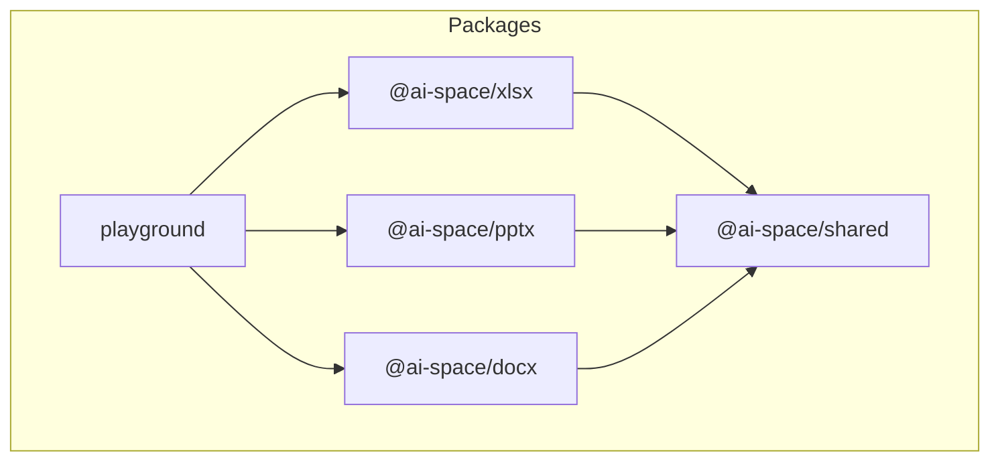
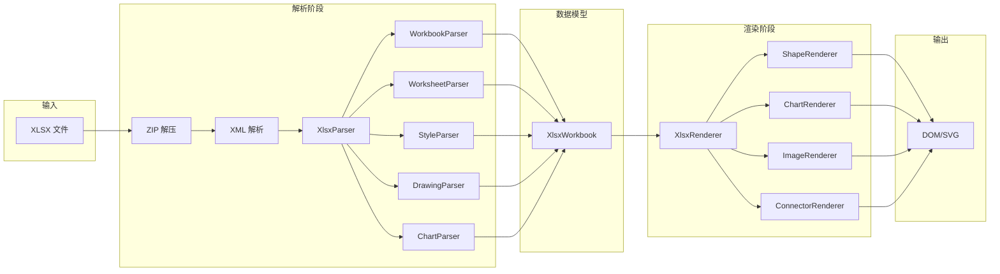
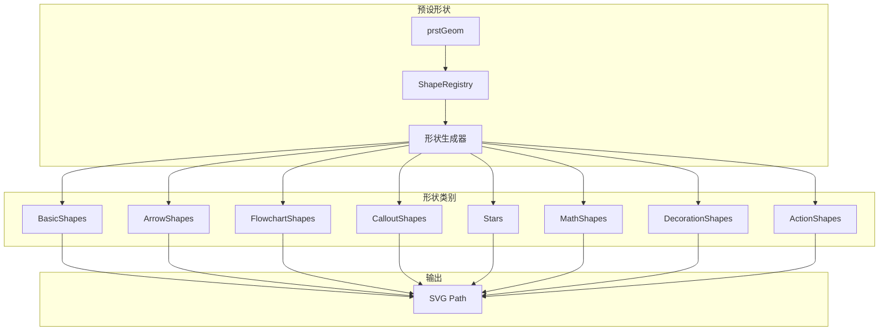

# 项目结构说明

本文档描述 Office 文档解析与渲染工具的项目结构和架构设计。

## 项目概述

本项目是一个用于解析和渲染 Microsoft Office 文档（XLSX、PPTX、DOCX）的工具库。它将 Office Open XML (OOXML) 格式的文档解析为结构化数据，并在浏览器中渲染为 DOM 和 SVG 元素，力求实现与 Office 软件像素级一致的显示效果。

## 目录结构

```
officeParserRenderer/
├── packages/                   # 主要源代码包
│   ├── shared/                 # 共享工具库 (@ai-space/shared)
│   │   └── src/
│   │       ├── index.ts        # 模块入口
│   │       ├── xml/            # XML 解析工具
│   │       ├── zip/            # ZIP 解压服务
│   │       ├── utils/          # 通用工具
│   │       │   ├── ColorUtils.ts      # 颜色处理
│   │       │   ├── Units.ts           # 单位转换
│   │       │   ├── geometry.ts        # 几何计算
│   │       │   └── PresetColorMap.ts  # 预设颜色映射
│   │       └── drawing/        # DrawingML 处理
│   │           ├── types.ts           # 类型定义
│   │           ├── DrawingMLParser.ts # 解析器门面
│   │           ├── ThemeEnums.ts      # 主题枚举
│   │           ├── parsers/           # 各类解析器
│   │           └── shapes/            # 形状生成器
│   │
│   ├── xlsx/                   # XLSX 处理库 (@ai-space/xlsx)
│   │   └── src/
│   │       ├── index.ts        # 模块入口
│   │       ├── types.ts        # 类型定义
│   │       ├── parser/         # 解析器
│   │       │   ├── XlsxParser.ts      # 主解析器
│   │       │   ├── WorkbookParser.ts  # 工作簿解析
│   │       │   ├── WorksheetParser.ts # 工作表解析
│   │       │   ├── StyleParser.ts     # 样式解析
│   │       │   ├── ThemeParser.ts     # 主题解析
│   │       │   ├── DrawingParser.ts   # 绘图解析
│   │       │   └── ChartParser.ts     # 图表解析
│   │       ├── renderer/       # 渲染器
│   │       │   ├── XlsxRenderer.ts    # 主渲染器
│   │       │   ├── ShapeRenderer.ts   # 形状渲染
│   │       │   ├── ChartRenderer.ts   # 图表渲染
│   │       │   ├── ImageRenderer.ts   # 图片渲染
│   │       │   ├── ConnectorRenderer.ts # 连接符渲染
│   │       │   └── StyleResolver.ts   # 样式解析辅助
│   │       └── utils/          # 工具类
│   │           ├── Enums.ts           # 枚举定义
│   │           └── NumberFormatUtils.ts # 数字格式化
│   │
│   ├── pptx/                   # PPTX 处理库 (规划中)
│   ├── docx/                   # DOCX 处理库 (规划中)
│   └── playground/             # 开发测试页面
│
├── definitions/                # TypeScript 类型定义
├── docments/                   # 测试文档
├── spec/                       # OOXML 规范参考
├── docs/                       # 项目文档
├── package.json                # 工作区配置
├── pnpm-workspace.yaml         # pnpm 工作区
└── tsconfig.base.json          # 基础 TypeScript 配置
```

## 架构图

### 模块依赖关系



### XLSX 处理流程



### DrawingML 形状生成



## 核心模块说明

### @ai-space/shared

共享工具库，提供：
- **ZIP 解压**：使用 fflate 库解压 OOXML 包
- **XML 解析**：DOM 解析器封装，支持命名空间宽松匹配
- **单位转换**：EMU、磅、像素等单位互转
- **颜色处理**：RGB/HSL 转换、tint/shade 调整
- **DrawingML 解析**：形状属性、填充、效果、文本等解析
- **预设几何**：生成各种预设形状的 SVG 路径

### @ai-space/xlsx

XLSX 文件处理库，提供：
- **解析器**：解析工作簿、工作表、样式、主题、绘图、图表
- **渲染器**：将解析结果渲染为 DOM 表格和 SVG 图形
- **数字格式化**：支持 Excel 数字格式字符串

### playground

开发测试页面，用于：
- 加载测试文档
- 预览渲染效果
- 与 Office 软件对比验证

## 技术栈

- **语言**：TypeScript
- **构建工具**：Vite
- **包管理**：pnpm (Monorepo)
- **ZIP 处理**：fflate
- **渲染**：原生 DOM + SVG

## 开发指南

### 安装依赖

```bash
pnpm install
```

### 开发模式

```bash
pnpm run pg:dev
```

### 构建

```bash
pnpm run build
```

## 相关资源

- [OOXML 规范 (ECMA-376)](https://www.ecma-international.org/publications-and-standards/standards/ecma-376/)
- [DrawingML 预设几何参考](http://www.datypic.com/sc/ooxml/t-a_ST_ShapeType.html)
