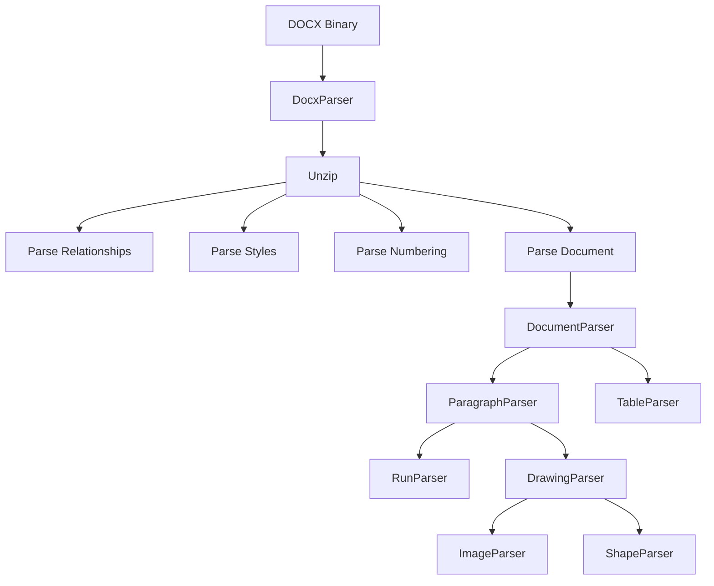

# Parser 模块

> DOCX 文档解析器模块

## 📝 简介

Parser 模块负责将 DOCX 文件的 XML 内容解析为结构化的 JavaScript 对象。它包含了处理文档各个部分（段落、文本运行、表格、图形等）的专门解析器。

## 🏗️ 模块结构

```
parser/
├── DocxParser.ts           # 主解析器 - 协调整个文档的解析流程
├── DocumentParser.ts       # 文档解析 - 解析 document.xml
├── ParagraphParser.ts      # 段落解析 - 解析段落元素
├── RunParser.ts            # 文本运行解析 - 解析文本运行和字符样式
├── TableParser.ts          # 表格解析 - 解析表格结构和样式
├── DrawingParser.ts        # 绘图解析 - 解析图片、形状等绘图元素
├── NumberingParser.ts      # 列表编号解析 - 解析列表和编号定义
├── StylesParser.ts         # 样式解析 - 解析样式定义
├── SectionParser.ts        # 分节解析 - 解析分节属性
├── HeaderFooterParser.ts   # 页眉页脚解析 - 解析页眉页脚内容
├── VmlParser.ts            # VML 解析 - 解析 VML 图形
├── ChartParser.ts          # 图表解析 - 解析图表数据
├── MediaParser.ts          # 媒体解析 - 解析图片等媒体资源
├── RelationshipsParser.ts  # 关系解析 - 解析文档间的关系
└── index.ts                # 导出文件
```

## 📖 核心解析器

### DocxParser

主解析器，协调整个 DOCX 文件的解析过程。

**职责：**
- 解压 DOCX 文件（ZIP 格式）
- 读取并解析 `document.xml`
- 协调各个子解析器的工作
- 构建完整的文档对象

**关键方法：**
```typescript
async parse(buffer: ArrayBuffer): Promise<DocxDocument>
```

**解析流程：**
1. 解压 DOCX 文件
2. 解析关系文件 (_rels/.rels, document.xml.rels)
3. 解析样式 (styles.xml)
4. 解析编号 (numbering.xml)
5. 解析主文档 (document.xml)
6. 解析页眉页脚
7. 解析媒体资源

### DocumentParser

解析 `document.xml` 的核心内容。

**职责：**
- 解析文档主体 (w:body)
- 解析段落、表格等顶层元素
- 解析文档背景设置

**关键方法：**
```typescript
parse(documentXml: Element, context: ParserContext): DocxDocument
```

### ParagraphParser

解析段落元素及其属性。

**职责：**
- 解析段落属性 (w:pPr)
- 解析段落内的文本运行
- 解析段落内的绘图元素
- 处理段落样式继承

**关键方法：**
```typescript
parse(pElement: Element, context: ParserContext): Paragraph
```

**解析内容：**
- 对齐方式 (w:jc)
- 缩进 (w:ind)
- 间距 (w:spacing)
- 边框 (w:pBdr)
- 阴影 (w:shd)
- 编号引用 (w:numPr)

### RunParser

解析文本运行（Run）及其字符样式。

**职责：**
- 解析文本内容 (w:t)
- 解析字符属性 (w:rPr)
- 解析特殊文本（制表符、换行符等）
- 处理字符样式继承

**关键方法：**
```typescript
parse(rElement: Element, context: ParserContext): Run
```

**解析内容：**
- 字体 (w:rFonts)
- 字号 (w:sz)
- 颜色 (w:color)
- 粗体 (w:b)
- 斜体 (w:i)
- 下划线 (w:u)
- 删除线 (w:strike)
- 上下标 (w:vertAlign)
- 高亮 (w:highlight)

### TableParser

解析表格结构和样式。

**职责：**
- 解析表格 (w:tbl)
- 解析表格行 (w:tr)
- 解析表格单元格 (w:tc)
- 解析表格样式和边框
- 处理单元格合并

**关键方法：**
```typescript
parse(tblElement: Element, context: ParserContext): Table
```

**解析内容：**
- 表格属性 (w:tblPr)
- 表格边框 (w:tblBorders)
- 单元格边框 (w:tcBorders)
- 单元格合并 (w:gridSpan, w:vMerge)
- 单元格背景 (w:shd)

### DrawingParser

解析 DrawingML 和内嵌图形。

**职责：**
- 解析绘图锚点和内联 (w:drawing)
- 解析图片 (pic:pic)
- 解析形状 (wps:wsp)
- 解析图表引用 (c:chart)
- 解析定位和大小信息

**关键方法：**
```typescript
parse(drawingElement: Element, context: ParserContext): Drawing
```

**解析内容：**
- 内联/锚点类型
- 位置信息 (wp:positionH, wp:positionV)
- 尺寸 (wp:extent)
- 环绕方式 (wp:wrapSquare, wp:wrapNone 等)
- 图片源
- 形状属性

### NumberingParser

解析列表和编号定义。

**职责：**
- 解析抽象编号定义 (w:abstractNum)
- 解析编号实例 (w:num)
- 解析各级别的编号格式
- 构建编号继承链

**关键方法：**
```typescript
parse(numberingXml: Element): NumberingDefinitions
```

**解析内容：**
- 编号格式 (w:numFmt)
- 编号文本 (w:lvlText)
- 起始值 (w:start)
- 缩进 (w:ind)
- 字符样式 (w:rPr)
- 段落样式 (w:pPr)

### StylesParser

解析文档样式定义。

**职责：**
- 解析样式定义 (w:styles)
- 解析段落样式 (w:style[@w:type='paragraph'])
- 解析字符样式 (w:style[@w:type='character'])
- 解析表格样式 (w:style[@w:type='table'])
- 构建样式继承链

**关键方法：**
```typescript
parse(stylesXml: Element): StyleDefinitions
```

### SectionParser

解析分节属性。

**职责：**
- 解析节属性 (w:sectPr)
- 解析页面设置
- 解析页眉页脚引用
- 解析分栏设置

**关键方法：**
```typescript
parse(sectPrElement: Element, context: ParserContext): Section
```

**解析内容：**
- 纸张大小 (w:pgSz)
- 页边距 (w:pgMar)
- 页眉页脚引用 (w:headerReference, w:footerReference)
- 分栏 (w:cols)
- 页码格式 (w:pgNumType)

### HeaderFooterParser

解析页眉和页脚。

**职责：**
- 解析页眉内容 (w:hdr)
- 解析页脚内容 (w:ftr)
- 支持不同类型的页眉页脚（首页、奇数页、偶数页）

**关键方法：**
```typescript
parseHeader(headerXml: Element, context: ParserContext): HeaderFooter
parseFooter(footerXml: Element, context: ParserContext): HeaderFooter
```

### VmlParser

解析 VML（Vector Markup Language）图形。

**职责：**
- 解析 VML 形状 (v:shape)
- 解析 VML 矩形 (v:rect)
- 解析 VML 样式属性
- 转换为标准图形对象

**关键方法：**
```typescript
parse(vmlElement: Element, context: ParserContext): VmlShape
```

**解析内容：**
- 形状路径
- 填充
- 边框
- 位置和大小
- 翻转和旋转

### ChartParser

解析图表数据。

**职责：**
- 解析图表定义 (c:chartSpace)
- 解析图表类型
- 解析系列数据
- 解析坐标轴
- 解析图例

**关键方法：**
```typescript
parse(chartXml: Element): Chart
```

**支持的图表类型：**
- 柱状图 (c:barChart)
- 折线图 (c:lineChart)
- 饼图 (c:pieChart)
- 面积图 (c:areaChart)
- 散点图 (c:scatterChart)

### MediaParser

解析媒体资源。

**职责：**
- 提取图片数据
- 提取嵌入对象
- 管理媒体 ID 映射

**关键方法：**
```typescript
getImage(imageId: string): ArrayBuffer | null
```

### RelationshipsParser

解析文档关系。

**职责：**
- 解析 .rels 文件
- 建立 ID 到资源路径的映射
- 支持图片、页眉页脚、图表等资源的引用

**关键方法：**
```typescript
parse(relsXml: Element): Relationships
```

## 🔄 解析流程



## 🎯 设计原则

1. **单一职责**：每个解析器只负责一种类型的元素
2. **上下文传递**：通过 `ParserContext` 共享样式、编号等全局信息
3. **懒加载**：仅在需要时解析资源（如图片、图表）
4. **错误容忍**：解析失败时返回默认值，不中断整个流程
5. **类型安全**：完整的 TypeScript 类型定义

## 🔧 使用示例

```typescript
import { DocxParser } from '@ai-space/docx';

const parser = new DocxParser();
const doc = await parser.parse(arrayBuffer);

// 访问解析结果
console.log('段落数量:', doc.body.paragraphs.length);
console.log('表格数量:', doc.body.tables.length);
console.log('样式数量:', Object.keys(doc.styles).length);
```

## 📚 相关文档

- [Renderer 模块](../renderer/README.md)
- [Types 定义](../types/README.md)
- [Office Open XML 规范](https://www.ecma-international.org/publications-and-standards/standards/ecma-376/)
