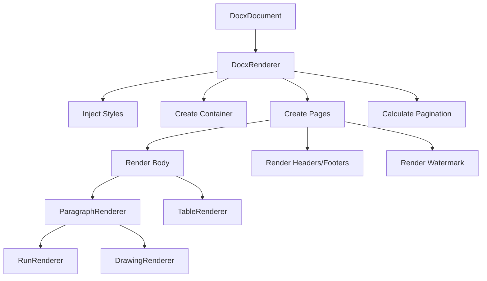

# Renderer 模块

> DOCX 文档渲染器模块

## 📝 简介

Renderer 模块负责将解析后的 DOCX 文档对象渲染为 DOM 元素。它包含了处理文档各个部分（段落、文本运行、表格、图形等）的专门渲染器，以及页面布局、样式注入等辅助组件。

## 🏗️ 模块结构

```
renderer/
├── DocxRenderer.ts         # 主渲染器 - 协调整个文档的渲染流程
├── ParagraphRenderer.ts    # 段落渲染 - 渲染段落和段落样式
├── RunRenderer.ts          # 文本运行渲染 - 渲染文本和字符样式
├── TableRenderer.ts        # 表格渲染 - 渲染表格结构和样式
├── DrawingRenderer.ts      # 绘图渲染 - 渲染图片、形状、图表
├── HeaderFooterRenderer.ts # 页眉页脚渲染 - 渲染页眉页脚
├── WatermarkRenderer.ts    # 水印渲染 - 渲染水印
├── PageCalculator.ts       # 页面计算器 - 计算分页位置
├── PageConfigManager.ts    # 页面配置管理 - 管理页面设置
├── PageLayoutManager.ts    # 页面布局管理 - 管理页面布局
├── ListCounter.ts          # 列表计数器 - 管理列表编号
├── StyleInjector.ts        # 样式注入器 - 注入 CSS 样式
└── index.ts                # 导出文件
```

## 📖 核心渲染器

### DocxRenderer

主渲染器，协调整个 DOCX 文档的渲染过程。

**职责：**
- 创建文档容器
- 管理页面创建
- 协调子渲染器渲染内容
- 应用文档级样式和设置
- 处理分页

**关键方法：**
```typescript
async render(doc: DocxDocument): Promise<DocxRenderResult>
setPageSize(pageSize: PageSize): void
setScale(scale: number): void
```

**渲染流程：**
1. 注入 CSS 样式
2. 创建文档容器
3. 计算页面布局
4. 渲染页面内容（段落、表格等）
5. 渲染页眉页脚
6. 渲染水印
7. 应用文档背景
8. 执行分页计算

### ParagraphRenderer

渲染段落及其样式。

**职责：**
- 创建段落 DOM 元素
- 应用段落样式（对齐、缩进、间距等）
- 渲染段落内的文本运行
- 渲染列表编号
- 应用段落边框和背景

**关键方法：**
```typescript
render(paragraph: Paragraph, context: RenderContext): HTMLElement
```

**应用的样式：**
- 对齐方式 (text-align)
- 缩进 (padding-left, text-indent)
- 行间距 (line-height)
- 段前段后距 (margin-top, margin-bottom)
- 边框 (border)
- 背景色 (background-color)
- 阴影 (box-shadow)

### RunRenderer

渲染文本运行及其字符样式。

**职责：**
- 创建文本 span 元素
- 应用字符样式（字体、大小、颜色等）
- 处理特殊文本（制表符、换行符等）
- 渲染超链接

**关键方法：**
```typescript
render(run: Run, context: RenderContext): HTMLElement
```

**应用的样式：**
- 字体 (font-family)
- 字号 (font-size)
- 颜色 (color)
- 粗体 (font-weight)
- 斜体 (font-style)
- 下划线 (text-decoration)
- 删除线 (text-decoration)
- 上下标 (vertical-align, font-size)
- 高亮 (background-color)

### TableRenderer

渲染表格结构和样式。

**职责：**
- 创建表格 DOM 元素
- 渲染表格行和单元格
- 应用表格样式和边框
- 处理单元格合并
- 应用单元格背景和边框

**关键方法：**
```typescript
render(table: Table, context: RenderContext): HTMLElement
```

**处理内容：**
- 表格边框
- 单元格边框
- 单元格合并 (colspan, rowspan)
- 单元格背景
- 单元格内边距
- 表格宽度
- 列宽设置

### DrawingRenderer

渲染绘图元素（图片、形状、图表）。

**职责：**
- 渲染图片
- 渲染形状（使用 shared/ShapeRenderer）
- 渲染图表（使用 shared/ChartRenderer）
- 渲染 VML 图形
- 处理绝对定位和相对定位
- 应用环绕方式

**关键方法：**
```typescript
render(drawing: Drawing, context: RenderContext): HTMLElement
```

**渲染类型：**
- 内联图片
- 锚点图片（绝对定位）
- 形状
- 文本框
- 图表
- VML 图形

**定位方式：**
- 内联 (inline)
- 相对于页面 (page)
- 相对于段落 (paragraph)
- 相对于列 (column)
- 相对于边距 (margin)

### HeaderFooterRenderer

渲染页眉和页脚。

**职责：**
- 渲染页眉内容
- 渲染页脚内容
- 处理不同类型（首页、奇数页、偶数页）
- 替换域代码（页码等）

**关键方法：**
```typescript
renderHeader(header: HeaderFooter, page: number, context: RenderContext): HTMLElement
renderFooter(footer: HeaderFooter, page: number, context: RenderContext): HTMLElement
```

**支持的域代码：**
- PAGE - 当前页码
- NUMPAGES - 总页数
- DATE - 当前日期
- TIME - 当前时间

### WatermarkRenderer

渲染文档水印。

**职责：**
- 渲染文本水印
- 渲染图片水印
- 应用水印样式（透明度、旋转等）

**关键方法：**
```typescript
render(watermark: Watermark, container: HTMLElement): void
```

### PageCalculator

计算分页位置。

**职责：**
- 检测页面溢出
- 计算分页位置
- 处理段落、表格的分页
- 避免孤行和寡行

**关键方法：**
```typescript
calculatePages(container: HTMLElement, pageHeight: number): PageBreak[]
```

**分页规则：**
- 段落不跨页（可选）
- 表格行不跨页
- 避免孤行（段落首行独占一页）
- 避免寡行（段落末行独占一页）
- 保持段落与后续内容在同一页（keepNext）
- 保持段落行在同一页（keepLines）

### PageConfigManager

管理页面配置。

**职责：**
- 管理纸张大小
- 管理页边距
- 管理页面方向
- 提供页面配置查询

**关键方法：**
```typescript
getPageSize(): { width: number; height: number }
getMargins(): Margins
setPageSize(pageSize: PageSize): void
```

**支持的纸张大小：**
- A4 (210mm × 297mm)
- A5 (148mm × 210mm)
- A3 (297mm × 420mm)
- Letter (8.5" × 11")
- Legal (8.5" × 14")
- 自定义尺寸

### PageLayoutManager

管理页面布局。

**职责：**
- 创建页面容器
- 应用页面样式
- 管理页面编号
- 管理页面可见性

**关键方法：**
```typescript
createPage(index: number): HTMLElement
applyPageStyles(page: HTMLElement, section: Section): void
```

### ListCounter

管理列表编号。

**职责：**
- 维护多级列表计数器
- 生成列表编号文本
- 处理编号重启
- 支持自定义编号格式

**关键方法：**
```typescript
getNumberText(numId: number, level: number): string
increment(numId: number, level: number): void
reset(numId: number, level: number): void
```

**支持的编号格式：**
- 阿拉伯数字 (1, 2, 3...)
- 小写字母 (a, b, c...)
- 大写字母 (A, B, C...)
- 小写罗马数字 (i, ii, iii...)
- 大写罗马数字 (I, II, III...)
- 项目符号 (•, ○, ▪...)
- 中文数字 (一, 二, 三...)

### StyleInjector

注入 CSS 样式。

**职责：**
- 注入基础样式
- 注入字体样式
- 注入自定义样式
- 管理样式优先级

**关键方法：**
```typescript
inject(container: HTMLElement): void
injectFontStyles(): void
```

**注入的样式：**
- 基础文档样式
- 字体定义
- 页面样式
- 段落样式
- 表格样式
- 列表样式

## 🔄 渲染流程



## 🎯 设计原则

1. **单一职责**：每个渲染器只负责一种类型的元素
2. **上下文传递**：通过 `RenderContext` 共享页面信息、计数器等
3. **增量渲染**：支持分页渲染，避免一次性渲染整个文档
4. **样式隔离**：使用 CSS 类和内联样式，避免样式冲突
5. **性能优化**：使用 DocumentFragment、缓存等技术优化性能

## 🔧 使用示例

```typescript
import { DocxRenderer } from '@ai-space/docx';

const container = document.getElementById('docx-container');
const renderer = new DocxRenderer(container, {
  pageSize: 'A4',
  scale: 1.0,
  showHeaderFooter: true,
  enablePagination: true
});

// 渲染文档
const result = await renderer.render(doc);
console.log(`渲染完成：${result.totalPages} 页`);

// 动态配置
renderer.setPageSize('Letter');
renderer.setScale(0.8);
renderer.setShowHeaderFooter(false);
```

## 📊 渲染性能

**优化策略：**
- 使用 DocumentFragment 批量插入 DOM
- 懒加载图片和图表
- 虚拟滚动（计划中）
- Web Worker 解析（计划中）
- 缓存样式计算结果

**性能指标：**
- 小文档 (<10页)：<100ms
- 中等文档 (10-50页)：<500ms
- 大文档 (50-100页)：<2s
- 特大文档 (>100页)：按需渲染

## 📚 相关文档

- [Parser 模块](../parser/README.md)
- [Types 定义](../types/README.md)
- [Styles 样式](../styles/README.md)
