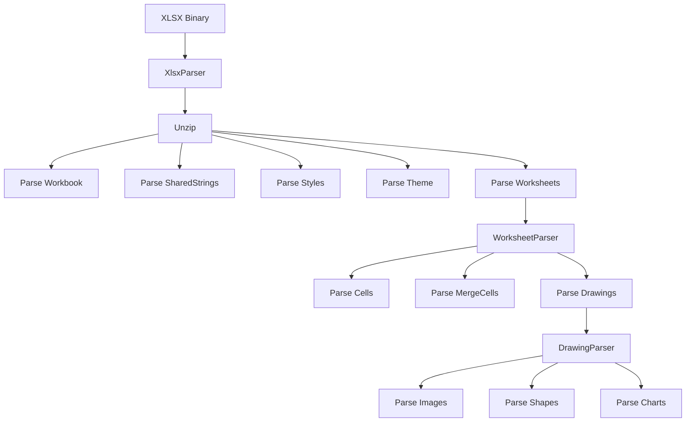

# Parser 模块

> XLSX 工作簿解析器模块

## 📝 简介

Parser 模块负责将 XLSX 文件的 XML 内容解析为结构化的 JavaScript 对象。它包含了处理工作簿各个部分（工作表、样式、绘图、图表等）的专门解析器。

## 🏗️ 模块结构

```
parser/
├── XlsxParser.ts       # 主解析器 - 协调整个工作簿的解析流程
├── WorkbookParser.ts   # 工作簿解析 - 解析 workbook.xml
├── WorksheetParser.ts  # 工作表解析 - 解析 worksheet.xml
├── StyleParser.ts      # 样式解析 - 解析 styles.xml
├── ThemeParser.ts      # 主题解析 - 解析 theme.xml
├── DrawingParser.ts    # 绘图解析 - 解析图片、形状等绘图元素
├── ChartParser.ts      # 图表解析 - 解析图表数据
└── index.ts            # 导出文件
```

## 📖 核心解析器

### XlsxParser

主解析器，协调整个 XLSX 文件的解析过程。

**职责：**
- 解压 XLSX 文件（ZIP 格式）
- 读取并解析工作簿结构
- 协调各个子解析器的工作
- 构建完整的工作簿对象

**关键方法：**
```typescript
async parse(buffer: ArrayBuffer): Promise<XlsxWorkbook>
```

**解析流程：**
1. 解压 XLSX 文件
2. 解析关系文件 (_rels/.rels, workbook.xml.rels)
3. 解析工作簿 (workbook.xml)
4. 解析共享字符串表 (sharedStrings.xml)
5. 解析样式 (styles.xml)
6. 解析主题 (theme/theme1.xml)
7. 解析工作表 (worksheets/sheet*.xml)
8. 解析绘图和图表

### WorkbookParser

解析 `workbook.xml` 的核心内容。

**职责：**
- 解析工作簿属性
- 解析工作表引用
- 解析定义的名称
- 解析计算属性

**关键方法：**
```typescript
parse(workbookXml: Element, context: ParserContext): WorkbookInfo
```

**解析内容：**
- 工作表列表 (sheets)
- 活动工作表索引
- 工作簿属性
- 计算模式

### WorksheetParser

解析工作表内容。

**职责：**
- 解析工作表维度
- 解析单元格数据
- 解析合并单元格
- 解析列宽和行高
- 解析绘图引用

**关键方法：**
```typescript
parse(worksheetXml: Element, context: ParserContext): Worksheet
```

**解析内容：**
- 单元格数据 (sheetData/row/c)
- 单元格值 (v)
- 单元格类型 (t: s-string, n-number, b-boolean, d-date)
- 单元格样式引用 (s)
- 单元格公式 (f)
- 合并单元格 (mergeCells/mergeCell)
- 列定义 (cols/col)
- 行属性 (row[@ht, @hidden])
- 超链接 (hyperlinks/hyperlink)
- 绘图引用 (drawing)

### StyleParser

解析样式定义。

**职责：**
- 解析单元格格式 (cellXfs)
- 解析字体样式 (fonts)
- 解析填充样式 (fills)
- 解析边框样式 (borders)
- 解析数字格式 (numFmts)

**关键方法：**
```typescript
parse(stylesXml: Element): StyleDefinitions
```

**解析内容：**

#### 字体 (fonts/font)
- 字体名称 (name)
- 字体大小 (sz)
- 颜色 (color)
- 粗体 (b)
- 斜体 (i)
- 下划线 (u)
- 删除线 (strike)
- 上下标 (vertAlign)

#### 填充 (fills/fill)
- 纯色填充 (patternFill[@patternType='solid'])
- 渐变填充 (gradientFill)
- 图案填充 (patternFill)

#### 边框 (borders/border)
- 左边框 (left)
- 右边框 (right)
- 上边框 (top)
- 下边框 (bottom)
- 对角线边框 (diagonal)
- 边框样式和颜色

#### 对齐 (alignment)
- 水平对齐 (horizontal)
- 垂直对齐 (vertical)
- 文本旋转 (textRotation)
- 自动换行 (wrapText)
- 缩进 (indent)

#### 数字格式 (numFmts/numFmt)
- 格式代码 (formatCode)
- 内置格式 ID

### ThemeParser

解析 Office 主题。

**职责：**
- 解析主题颜色方案
- 解析字体方案
- 建立颜色索引映射

**关键方法：**
```typescript
parse(themeXml: Element): Theme
```

**解析内容：**
- 主题颜色 (clrScheme)
  - dk1, lt1 (深色1, 浅色1 - 文本/背景)
  - dk2, lt2 (深色2, 浅色2 - 文本/背景)
  - accent1 ~ accent6 (强调色1-6)
  - hlink (超链接)
  - folHlink (已访问的超链接)
- 字体方案 (fontScheme)
  - majorFont (标题字体)
  - minorFont (正文字体)

### DrawingParser

解析绘图元素。

**职责：**
- 解析绘图关系文件
- 解析图片 (pic:pic)
- 解析形状 (xdr:sp)
- 解析连接线 (xdr:cxnSp)
- 解析图表引用 (c:chart)
- 解析锚点定位

**关键方法：**
```typescript
parse(drawingXml: Element, context: ParserContext): Drawing[]
```

**解析内容：**
- 双单元格锚点 (xdr:twoCellAnchor)
  - 起始位置 (xdr:from)
  - 结束位置 (xdr:to)
- 单单元格锚点 (xdr:oneCellAnchor)
  - 起始位置 (xdr:from)
  - 尺寸 (xdr:ext)
- 绝对锚点 (xdr:absoluteAnchor)
  - 位置 (xdr:pos)
  - 尺寸 (xdr:ext)

**定位信息：**
- 列索引 (xdr:col)
- 列内偏移 (xdr:colOff) - EMU 单位
- 行索引 (xdr:row)
- 行内偏移 (xdr:rowOff) - EMU 单位

### ChartParser

解析图表数据。

**职责：**
- 解析图表定义 (c:chartSpace)
- 解析图表类型
- 解析系列数据
- 解析坐标轴
- 解析图例

**关键方法：**
```typescript
parse(chartXml: Element): Chart
```

**支持的图表类型：**
- 柱状图 (c:barChart)
- 折线图 (c:lineChart)
- 饼图 (c:pieChart)
- 面积图 (c:areaChart)
- 散点图 (c:scatterChart)

**解析内容：**
- 图表类型 (c:barChart, c:lineChart 等)
- 系列数据 (c:ser)
  - 系列名称 (c:tx)
  - 类别数据 (c:cat)
  - 值数据 (c:val)
- 坐标轴 (c:catAx, c:valAx)
- 图例 (c:legend)
- 数据标签 (c:dLbls)

## 🔄 解析流程



## 🎯 单元格坐标系统

### A1 引用格式
- `A1` = 第1行第1列
- `B5` = 第5行第2列
- `AA10` = 第10行第27列

### 坐标转换
```typescript
// 列字母转索引
function colLetterToIndex(col: string): number {
  // A -> 0, B -> 1, ... Z -> 25, AA -> 26
}

// 索引转列字母
function colIndexToLetter(index: number): string {
  // 0 -> A, 1 -> B, ... 25 -> Z, 26 -> AA
}

// A1 转坐标
function a1ToCoords(a1: string): { row: number; col: number } {
  // "B5" -> { row: 4, col: 1 }  (0-based)
}
```

## 🎨 样式索引系统

XLSX 样式采用索引引用机制：

```
单元格 (c[@s="2"])
  ↓
cellXfs[2]
  ↓ fontId="1"    ↓ fillId="2"    ↓ borderId="1"
fonts[1]        fills[2]        borders[1]
```

## 📊 数字格式

### 内置格式 (0-49)
- 0: General
- 1: 0
- 2: 0.00
- 9: 0%
- 10: 0.00%
- 14: m/d/yy
- 15: d-mmm-yy
- ...

### 自定义格式
```typescript
{
  numFmtId: 164,
  formatCode: "[$-409]m/d/yy h:mm AM/PM;@"
}
```

## 🔧 使用示例

```typescript
import { XlsxParser } from '@ai-space/xlsx';

const parser = new XlsxParser();
const workbook = await parser.parse(arrayBuffer);

// 访问解析结果
console.log('工作表数量:', workbook.sheets.length);
console.log('第一个工作表:', workbook.sheets[0].name);
console.log('A1 单元格:', workbook.sheets[0].cells['A1']);
console.log('样式数量:', workbook.styles.cellXfs.length);
```

## 📚 相关文档

- [Renderer 模块](../renderer/README.md)
- [Types 定义](../types/README.md)
- [Office Open XML 规范](https://www.ecma-international.org/publications-and-standards/standards/ecma-376/)
- [SpreadsheetML 参考](https://docs.microsoft.com/en-us/openspecs/office_standards/ms-xlsx/)
