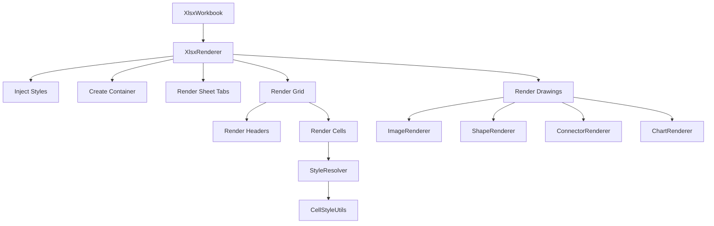

# Renderer 模块

> XLSX 工作簿渲染器模块

## 📝 简介

Renderer 模块负责将解析后的 XLSX 工作簿对象渲染为 DOM 元素。它包含了处理工作簿各个部分（单元格、样式、绘图、图表等）的专门渲染器，以及布局计算、样式解析等辅助组件。

## 🏗️ 模块结构

```
renderer/
├── XlsxRenderer.ts         # 主渲染器 - 协调整个工作簿的渲染流程
├── ShapeRenderer.ts        # 形状渲染 - 渲染形状元素
├── ImageRenderer.ts        # 图片渲染 - 渲染图片元素
├── ConnectorRenderer.ts    # 连接线渲染 - 渲染连接线
├── ChartRenderer.ts        # 图表渲染 - 渲染图表
├── StyleResolver.ts        # 样式解析器 - 解析单元格样式
├── CellStyleUtils.ts       # 单元格样式工具 - 应用单元格样式
├── LayoutCalculator.ts     # 布局计算器 - 计算行列位置
├── SheetLayoutManager.ts   # 工作表布局管理 - 管理工作表布局
├── XlsxStyleInjector.ts    # 样式注入器 - 注入 CSS 样式
├── constants.ts            # 常量定义
└── index.ts                # 导出文件
```

## 📖 核心渲染器

### XlsxRenderer

主渲染器，协调整个 XLSX 工作簿的渲染过程。

**职责：**
- 创建工作簿容器
- 渲染工作表标签
- 渲染单元格网格
- 渲染绘图元素
- 处理工作表切换
- 支持虚拟滚动

**关键方法：**
```typescript
async render(workbook: XlsxWorkbook): Promise<void>
switchSheet(sheetIndex: number): void
scrollTo(row: number, col: number): void
getCellValue(row: number, col: number): any
```

**渲染流程：**
1. 注入 CSS 样式
2. 创建工作簿容器
3. 创建工作表标签栏
4. 创建工作表内容区
5. 渲染单元格网格
6. 渲染行号和列标
7. 渲染绘图元素
8. 设置事件监听

**DOM 结构：**
```html
<div class="xlsx-container">
  <div class="xlsx-sheet-tabs">
    <div class="xlsx-sheet-tab active">Sheet1</div>
    <div class="xlsx-sheet-tab">Sheet2</div>
  </div>
  <div class="xlsx-content">
    <div class="xlsx-grid">
      <div class="xlsx-row-headers">...</div>
      <div class="xlsx-col-headers">...</div>
      <div class="xlsx-cells">
        <div class="xlsx-cell" data-row="0" data-col="0">...</div>
      </div>
    </div>
    <div class="xlsx-drawings-layer">
      
      <svg class="xlsx-shape">...</svg>
    </div>
  </div>
</div>
```

### StyleResolver

解析和计算单元格的最终样式。

**职责：**
- 解析单元格样式索引
- 合并字体、填充、边框、对齐样式
- 解析数字格式
- 解析主题颜色
- 缓存样式计算结果

**关键方法：**
```typescript
resolve(cellStyleIndex: number): CellStyle
resolveFont(fontIndex: number): Font
resolveFill(fillIndex: number): Fill
resolveBorder(borderIndex: number): Border
resolveNumberFormat(numFmtId: number): string
```

**样式解析流程：**
```
单元格样式索引 (s="2")
  ↓
cellXfs[2] → { fontId, fillId, borderId, numFmtId, alignment }
  ↓
fonts[fontId] + fills[fillId] + borders[borderId] + numFmts[numFmtId]
  ↓
最终样式对象
```

### CellStyleUtils

应用单元格样式到 DOM 元素。

**职责：**
- 应用字体样式
- 应用填充样式
- 应用边框样式
- 应用对齐样式
- 格式化单元格值

**关键方法：**
```typescript
applyCellStyle(element: HTMLElement, style: CellStyle): void
applyFontStyle(element: HTMLElement, font: Font): void
applyFillStyle(element: HTMLElement, fill: Fill): void
applyBorderStyle(element: HTMLElement, border: Border): void
applyAlignment(element: HTMLElement, alignment: Alignment): void
formatCellValue(value: any, numFmt: string): string
```

**应用的样式：**

#### 字体样式
- font-family
- font-size
- color
- font-weight (bold)
- font-style (italic)
- text-decoration (underline, line-through)
- vertical-align (superscript, subscript)

#### 填充样式
- background-color (纯色)
- background-image (渐变)
- background-repeat, background-size (图案)

#### 边框样式
- border-left
- border-right
- border-top
- border-bottom
- border-style (solid, dashed, dotted, double)
- border-color

#### 对齐样式
- text-align (left, center, right, justify)
- vertical-align (top, middle, bottom)
- transform: rotate() (文本旋转)
- white-space (wrap-text)
- padding-left (indent)

### LayoutCalculator

计算行列的位置和尺寸。

**职责：**
- 计算列的水平位置
- 计算行的垂直位置
- 处理自定义列宽
- 处理自定义行高
- 处理隐藏行列

**关键方法：**
```typescript
getColumnLeft(col: number): number
getRowTop(row: number): number
getColumnWidth(col: number): number
getRowHeight(row: number): number
getTotalWidth(): number
getTotalHeight(): number
```

**默认尺寸：**
- 默认列宽：64px (8.43 字符宽度)
- 默认行高：20px (15 点)
- 行号列宽：40px
- 列标行高：20px

**自定义尺寸：**
```typescript
// 列宽定义
<col min="2" max="2" width="15" customWidth="1"/>
// 转换为像素：width * 7 = 105px

// 行高定义
<row r="5" ht="30" customHeight="1"/>
// 转换为像素：ht * 1.33 = 40px
```

### SheetLayoutManager

管理工作表的整体布局。

**职责：**
- 管理滚动区域
- 管理冻结窗格
- 管理选中单元格
- 管理可见区域

**关键方法：**
```typescript
setScrollPosition(scrollLeft: number, scrollTop: number): void
setFreezePane(row: number, col: number): void
setSelection(row: number, col: number, rowSpan?: number, colSpan?: number): void
getVisibleRange(): { startRow, endRow, startCol, endCol }
```

### ShapeRenderer

渲染形状元素。

**职责：**
- 渲染预设形状
- 应用形状样式
- 处理形状定位（基于 shared/ShapeRenderer）

**关键方法：**
```typescript
render(shape: Shape, worksheet: Worksheet): SVGElement
```

### ImageRenderer

渲染图片元素。

**职责：**
- 渲染图片
- 处理图片定位
- 处理图片缩放（基于 shared/ImageRenderer）

**关键方法：**
```typescript
render(image: Image, worksheet: Worksheet): HTMLImageElement
```

### ConnectorRenderer

渲染连接线元素。

**职责：**
- 渲染直线连接线
- 渲染曲线连接线
- 渲染箭头
- 处理连接点

**关键方法：**
```typescript
render(connector: Connector, worksheet: Worksheet): SVGElement
```

**连接线类型：**
- 直线 (straight)
- 肘形线 (elbow)
- 曲线 (curved)

### ChartRenderer

渲染图表元素（基于 shared/ChartRenderer）。

**职责：**
- 渲染图表容器
- 委托给 shared/ChartRenderer 渲染图表内容
- 处理图表定位

**关键方法：**
```typescript
render(chart: Chart, worksheet: Worksheet): HTMLElement
```

### XlsxStyleInjector

注入 XLSX 专用的 CSS 样式。

**职责：**
- 注入网格样式
- 注入单元格样式
- 注入工作表标签样式
- 注入滚动条样式

**关键方法：**
```typescript
inject(container: HTMLElement): void
```

## 🎨 绘图定位系统

### 双单元格锚点 (Two-Cell Anchor)

绘图由两个单元格坐标定位（起始和结束）：

```xml
<xdr:twoCellAnchor>
  <xdr:from>
    <xdr:col>1</xdr:col>      <!-- 起始列：B -->
    <xdr:colOff>38100</xdr:colOff> <!-- 列内偏移：EMU -->
    <xdr:row>2</xdr:row>      <!-- 起始行：3 -->
    <xdr:rowOff>0</xdr:rowOff>     <!-- 行内偏移：EMU -->
  </xdr:from>
  <xdr:to>
    <xdr:col>5</xdr:col>      <!-- 结束列：F -->
    <xdr:colOff>0</xdr:colOff>
    <xdr:row>10</xdr:row>     <!-- 结束行：11 -->
    <xdr:rowOff>0</xdr:rowOff>
  </xdr:to>
</xdr:twoCellAnchor>
```

**坐标计算：**
```typescript
// 起始位置
const left = getColumnLeft(fromCol) + emuToPx(fromColOff);
const top = getRowTop(fromRow) + emuToPx(fromRowOff);

// 尺寸
const width = getColumnLeft(toCol) + emuToPx(toColOff) - left;
const height = getRowTop(toRow) + emuToPx(toRowOff) - top;
```

### 单单元格锚点 (One-Cell Anchor)

绘图由起始单元格 + 固定尺寸定位：

```xml
<xdr:oneCellAnchor>
  <xdr:from>...</xdr:from>
  <xdr:ext cx="1905000" cy="1828800"/>  <!-- 宽度和高度：EMU -->
</xdr:oneCellAnchor>
```

### 绝对锚点 (Absolute Anchor)

绘图使用绝对坐标定位：

```xml
<xdr:absoluteAnchor>
  <xdr:pos x="0" y="0"/>  <!-- 位置：EMU -->
  <xdr:ext cx="1905000" cy="1828800"/>  <!-- 尺寸：EMU -->
</xdr:absoluteAnchor>
```

## 📊 虚拟滚动

为了提高大工作表的渲染性能，XlsxRenderer 支持虚拟滚动：

**工作原理：**
1. 计算可见区域的行列范围
2. 仅渲染可见区域的单元格
3. 监听滚动事件
4. 动态更新可见单元格

**性能提升：**
- 小工作表 (<1000 cells)：无明显差异
- 中等工作表 (1000-10000 cells)：2-5x 提升
- 大工作表 (>10000 cells)：10x+ 提升

## 🔄 渲染流程



## 🎯 设计原则

1. **虚拟滚动**：仅渲染可见单元格，提高性能
2. **样式缓存**：缓存样式计算结果，避免重复计算
3. **懒加载**：按需加载图片和图表资源
4. **层次渲染**：单元格层 + 绘图层分离
5. **事件委托**：使用事件委托处理单元格交互

## 🔧 使用示例

```typescript
import { XlsxRenderer } from '@ai-space/xlsx';

const container = document.getElementById('xlsx-container');
const renderer = new XlsxRenderer(container);

// 渲染工作簿
await renderer.render(workbook);

// 切换工作表
renderer.switchSheet(1);

// 滚动到指定单元格
renderer.scrollTo(100, 5);

// 获取单元格值
const value = renderer.getCellValue(0, 0);
console.log('A1:', value);
```

## 📚 相关文档

- [Parser 模块](../parser/README.md)
- [Types 定义](../types/README.md)
- [Shared/Drawing 模块](../../shared/src/drawing/README.md)
